# The Project AISLE Hate Speech Analyzer

## Introduction

The project AISLE is aimed to develop an automatic hate speech detector in social media posts. This software application analyzes given social media account's posts automatically and produce reports.

It is an effective way of analyzing social media posts. It can read and filter hate speech words much quicker than humans. It goes through one post by one in the given social media account/page.

This project has two main components those are frontend (hate speech analyzer) and backend (management panel). The frontend is responsible for analyzing social media posts automatically, frontend is written in Python. The management panel is the backend for this system. Hate speech keywords, social media accounts/pages, hate speech contexts could be added in the management panel.

This system has manual and automatic processing methods. In the manual processing, the user needs to copy the post contents via pressing CTRL + C, when the contents are copied, they are processed in background to detect hate keywords. In the automatic processing method, no need to have a user to copy the posts' contents, all of the copy and processing works are done by the system itself.

## Features

- Automatic social media post analyzation.
- Top ten trending hate keywords.
- It supports Tamil and Sinhala languages (Unicode).
- Good looking management panel.
- Hate keywords could be inserted from the backend (management panel)
- Social media accounts could be added from the backed.
- Hate speech spreaders rankings
- Hate keywords could be divided by contexts.

## Diagram

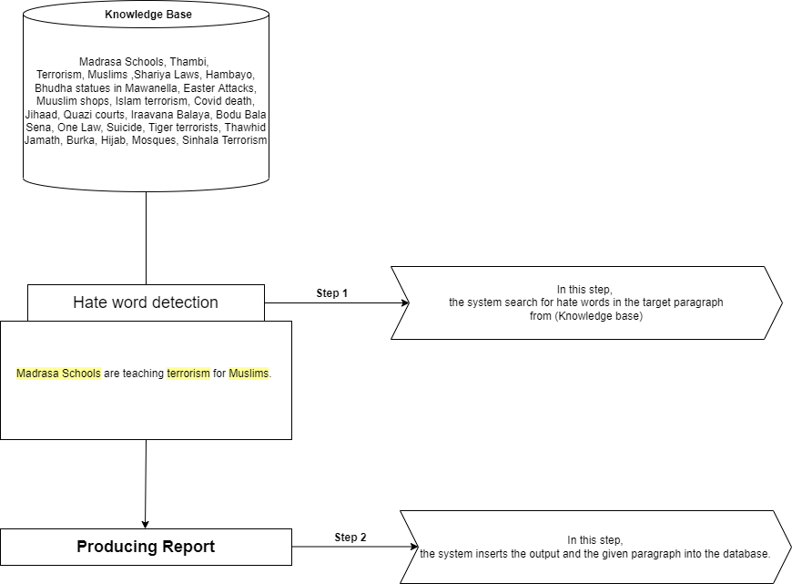


## Technologies & Frameworks

#### Frontend & Main Technology
  - C#
  - Python
  - pyttsx3    - For text to speech
  - pynput     - For keyboard
  - pyperclip  - For copy and paste clipboard functions.


#### Backend
  - Laravel 8.68.1
  - MySQL


## Configuration and Setup

### Setup Backend

##### Step 01:
  - Create an empty database called **"the-project-aisle"** in the MySQL and import the database that is found on the **"2-the-project-aisle-database"** folder of this repository.


##### Step 02:
 - Host the Laravel backend management panel (1-the-project-aisle-backend).


#### Login credentials of backend (Management Panel)

- Username:- **admin**
- Password:- **admin**

### Setup frontend

##### Step 01:

- Install pyttsx3

  ```
    pip install pyttsx3
  ```

- Install pyperclip

  ```
    pip install pyperclip
  ```

- Install MySQL connector

  ```
    pip install mysql-connector-python
  ```

- Install MySQL pynput

  ```
    pip install pynput
  ```

**IMPORTANT NOTE:** When you install a dependency by using "pip install", it will install the latest version of the dependency. Sometimes, we need the exact version that is used in the project to errors. **To find the dependencies' version, please check out 'required-dependencies.txt'** that is found on the project folder.

## Execution and Running

  - After the backed hosting, database configuration and frontend frameworks are installed, the project AISLE can be run.


##### Step 01:
 - Open the project using visual studio and click debugging to start the frontend of the application. (Note: This fronted part is written is Python and C#. C# is used for GUI purpose, Python scripts are connected with C#.)

##### Step 02:

  - The second way of running the fronted is manually open the EXE file that is found on the following path.

  ```
    the-project-aisle-hate-speech-analyzer/0-the-project-aisle-frontend/the_project_aisle_client/bin/Debug/the_project_aisle_client.exe
  ```

  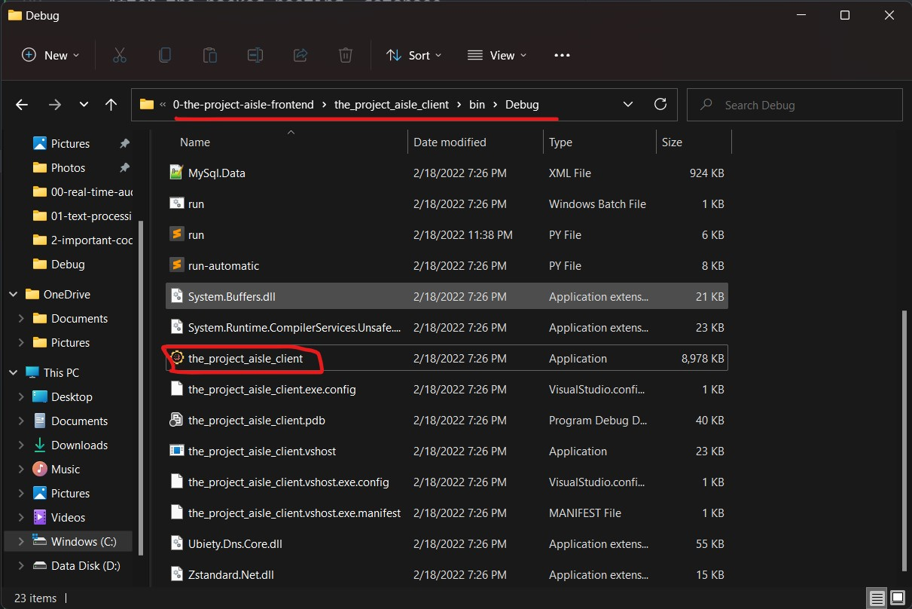


## Frontend Explained

The frontend part is the main component of this application that does the hate speech analyzing.

 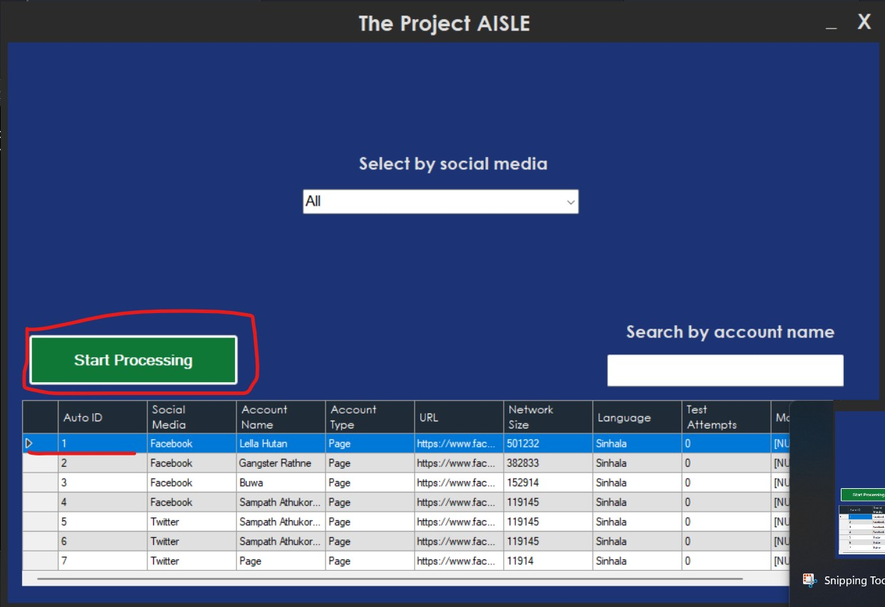

It will show all of the target social media accounts and pages in the bellow table. The user needs to select the account or page in order to start the processing. Click the start processing green button to begin the hate keywords analyzing in the selected account or page. (Note: The list of social media accounts and pages are coming from the backend of this application. These social media details could be entered from the management panel (backend), The backend management panel will be explained later).


## Demo

 

**Note:** By default, the system is ready perform manual processing. If you press **CTRL + C**, It will process the copied clipboard text in the background. However, in the manual processing user needs to scroll down and copy and copy. If user wants to process automatically without many involvement such as scrolling, press **CTRL + Q** to turn on the automatic processing method. In the automatic processing, no need to scroll, the system automatically handles all works. To turn of automatic mode, again press **CTRL + Q**.

Note:- To turn on automatic processing mode: Press **CTRL + Q**


## Backend Explained

The backed management panel is the place where all of the social media data, hate keywords, contexts are stored and maintained.


### Login page

This is the login page of the system. Here, there is only one account that is admin account. The username and the password are given bellow.

- Username:- **admin**
- Password:- **admin**


#### Features

- Login function
- Login Error popup messages

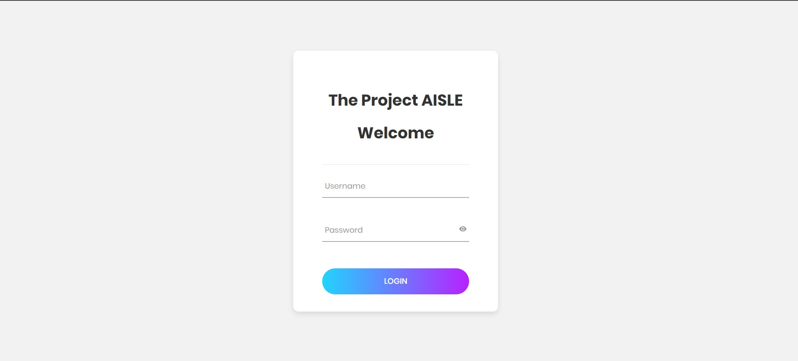


### Dashboard Homepage

The dashboard homepage is the main analytics report board where admin can see all the accounts and hate keywords that involves hate speeches.

#### Features
- Shows top ten trending hate keywords.
- Shows top ten hate speech spreaders (Account/Page)
- Shows the number times a particular hate keyword is repeated.
-  Shows reports for Tamil and Sinhala language separately.

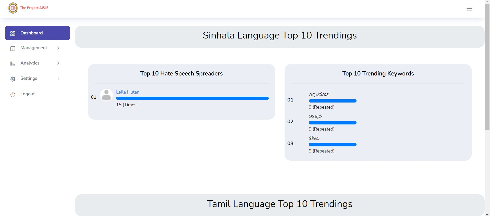
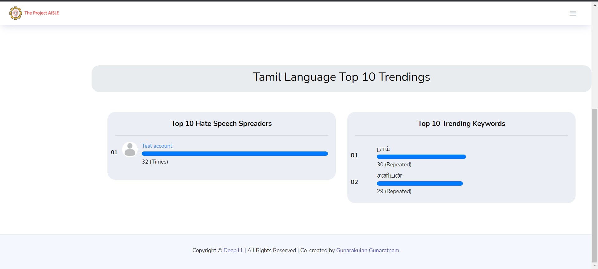

### Management Social Media

This module is the place where the social media pages and accounts details are stored and maintained. These social media data are displayed in the C# (frontend) of the application, from there the user can select the social media to process.


#### Features
- Insert social media accounts and pages
- Edit social media accounts and pages details
- Delete social media accounts and pages.

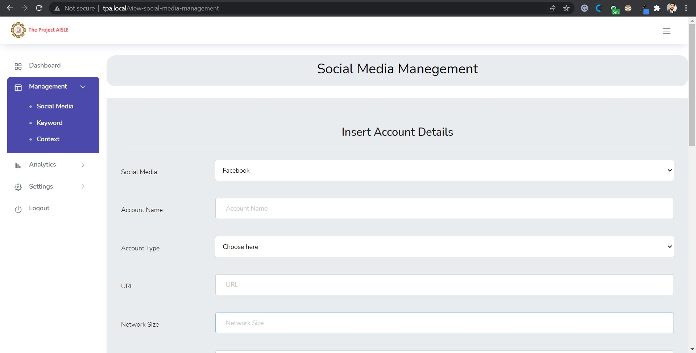
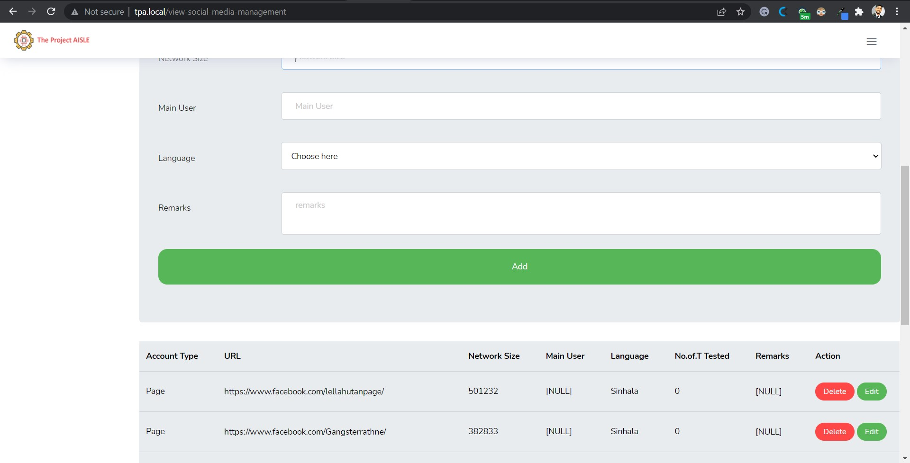


### Management Keyword

This module is the place where the hate keywords are stored and maintained. This is the hate speech knowledgebase. When processing, the system looks for matches from this knowledgebase.


#### Features
- Insert hate keywords
- Add tags of context
- Delete hate keywords

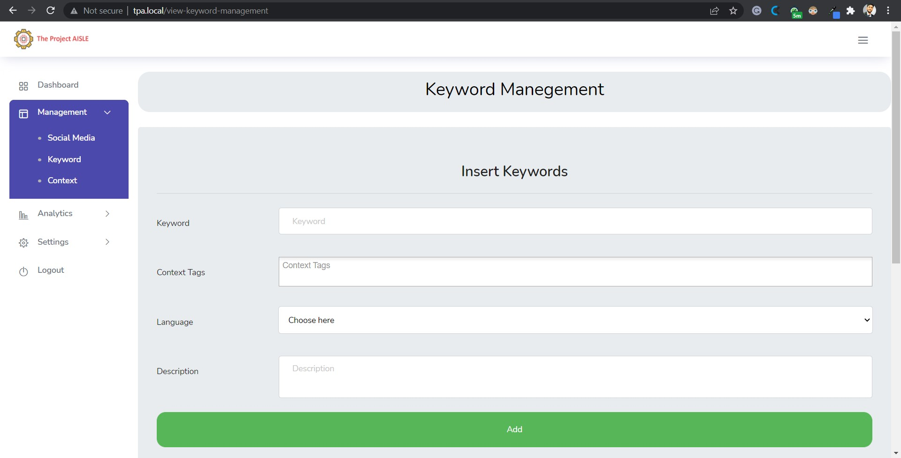
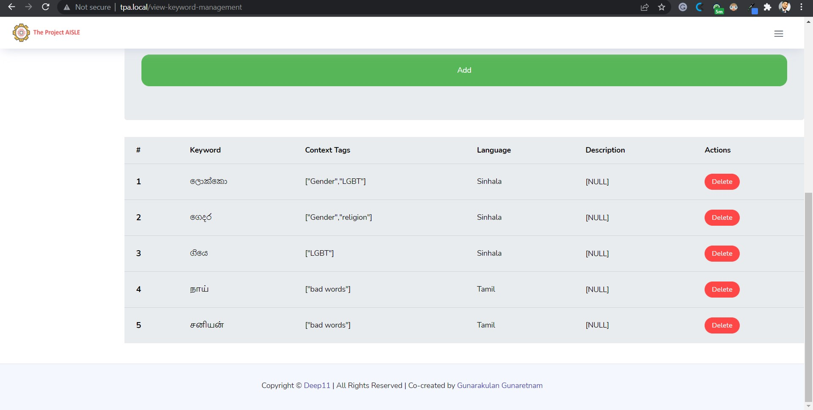

### Management Context

Every hate keyword can go under categories of contexts that means some keywords are belongs to religion based hate speech, some are belongs to gender based, some are belongs to race and gender. Therefore, context defines the category.   


#### Features
- Insert contexts
- Delete contexts

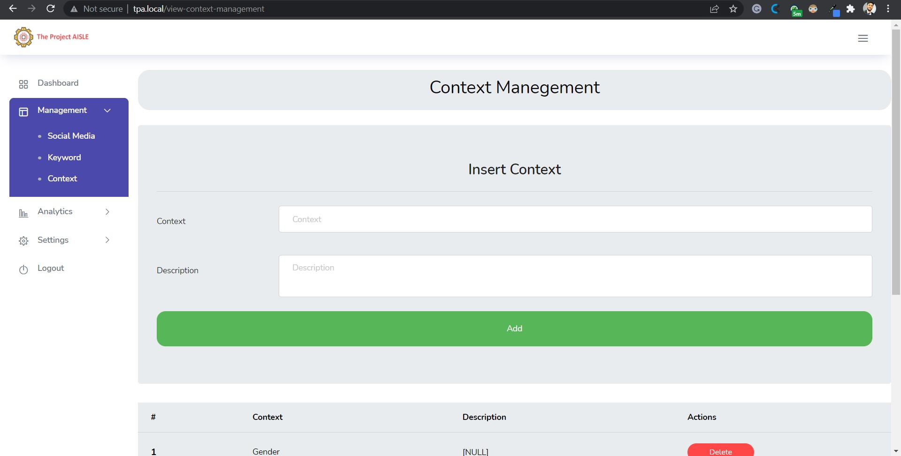
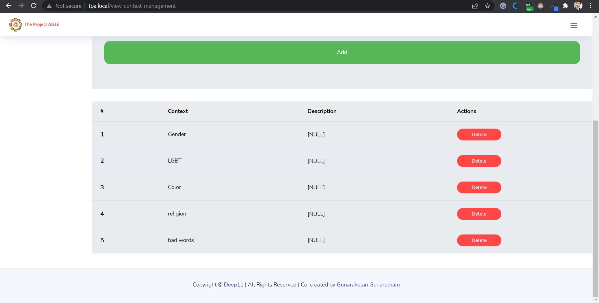


### Analytics Rankings

This is similar to top ten trending keywords and hate speech spreaders. This modules provide ranking for each social media accounts and pages based on the hate keywords that has used.  


#### Features
- Show ranking for trending keywords based on the number of times.
- Show ranking for hate speech spreaders (Accounts / Pages)
- Show ranking for Tamil and Sinhala

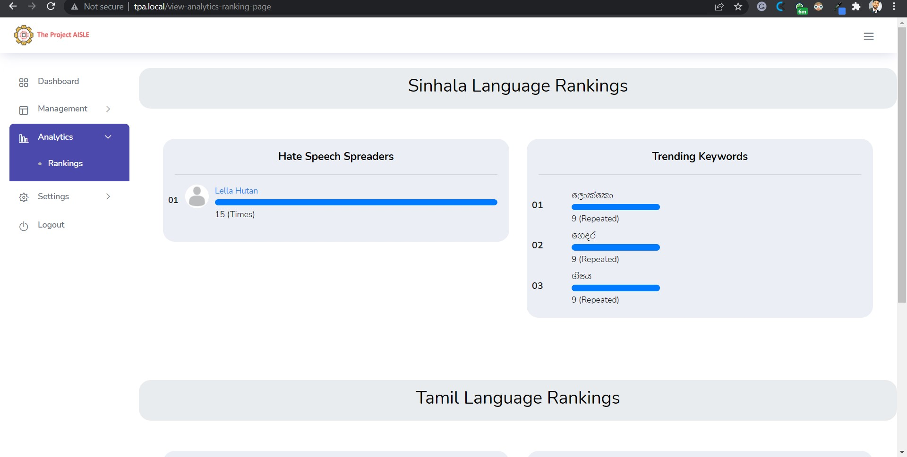
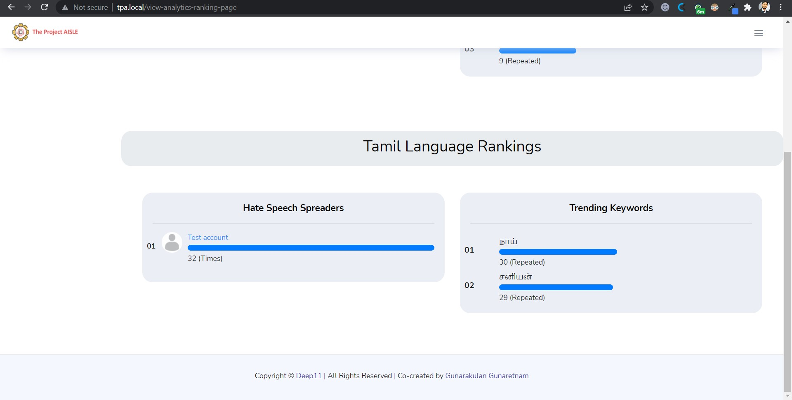


### Settings User Settings

This is settings page of the admin panel. It has only one function by now, that is changing password of admin account.

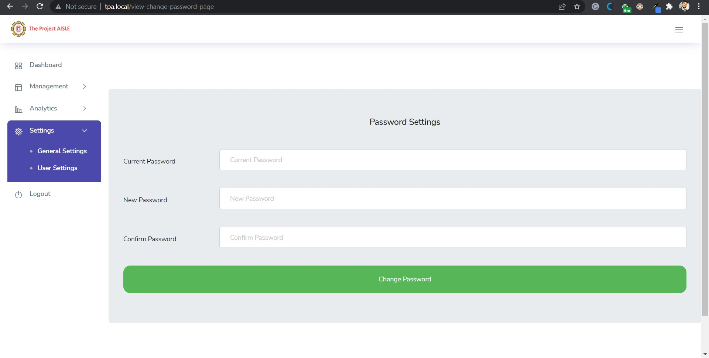


Any Questions? | Conduct Me
---

* [Linkedin Profile](https://www.linkedin.com/in/gunarakulan-gunaretnam-161119156/)
* [Facebook Profile](https://www.facebook.com/gunarakulan)
* [Twitter Profile](https://twitter.com/gunarakulang)
* [Instagram Profile](https://www.instagram.com/gunarakulan_gunaretnam/)
* [YouTube Channel](https://www.youtube.com/channel/UCMWkED5sabgVZSCKjZuRJXA/videos)
